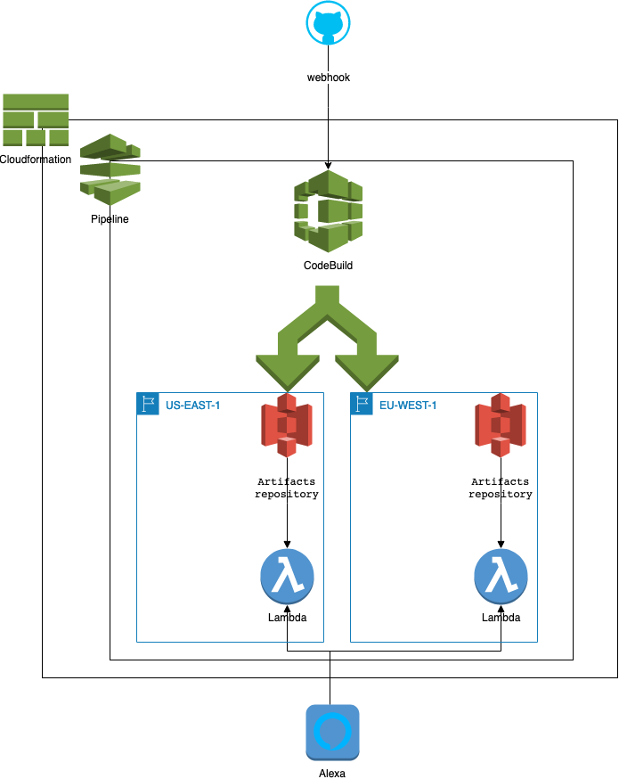

## Install

### Run the project on locahost
* Clone the project: git clone git@github.com:shirkalab/jovo-alexa-apl-sample.git
* Open a terminal and in the root folder of the project run "jovo build -d -p alexaSkill" to build and deploy the project on Alexa developer console.
* Start the local server:  jovo run -w --timeout 10000

If eveyrthing works fine, say to your Alexa device "alexa, open my sample app"

#### Run the project on AWS Lambda with CloudFormation
The project will be deploy by a cloudformation [stack](./cloudformation/stack.yml) on 2 AWS region.
Deploying on several regions is usefull for Multilanguage Skill. To reduce latency, AWS servers will use the Lambda location closest to the end-user.

##### Stack description

##### Before starting, have look to :
* [Cloudformation GitHub](https://docs.aws.amazon.com/fr_fr/codepipeline/latest/userguide/tutorials-cloudformation-github.html)
* [Get access token from github](https://help.github.com/en/articles/creating-a-personal-access-token-for-the-command-line)

#### prerequisite

* create 2 S3 buckets: As cloudformation can't create S3 bucket in multiple regions, you need to manualy create 2 buckets on eu-west-1 and us-east-1
* fork this project under your github account.

The stack have several parameters:
  * AppName: Stack name
  * ProjectId: project identifier use to create AWS ressource 
  * BucketNameEU: bucket name in eu-weast-1 region
  * BucketNameUS: bucket name in us-west-1 region
  * BranchName: master
  * RepositoryName: jovo-alexa-apl-sample
  * GitHubOwner: your github account name
  * GitHubSecret: webhook secret
  * GitHubOAuthToken: your acces token
